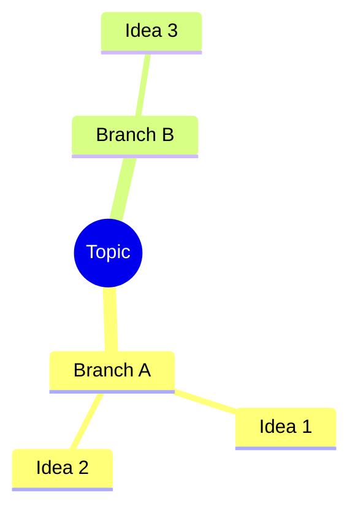

# Mind Map Template (Mermaid)

```mermaid
mindmap
  root((Topic))
    Branch A
      Idea 1
      Idea 2
    Branch B
      Idea 3
```

Guidelines:
- Save source in **docs/mindmaps/**.
- If using Draw.io or FreeMind, commit the source file and also export a PNG.
